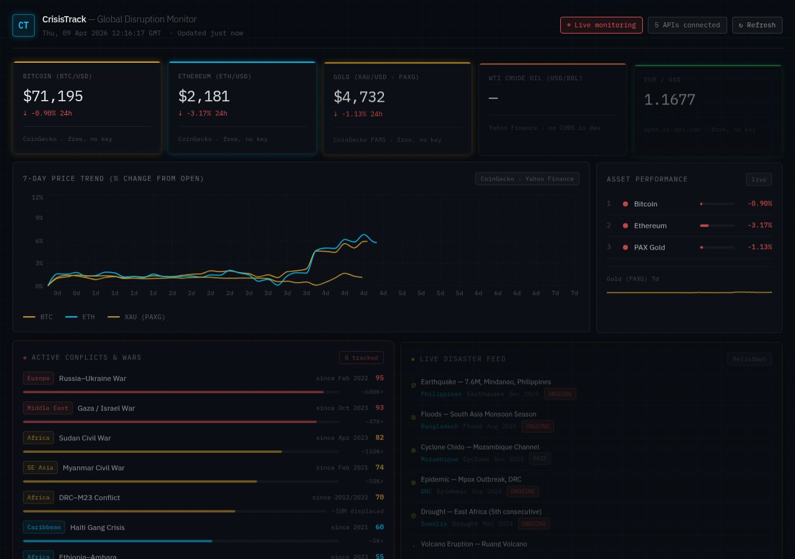

# CrisisTrack — Global Disruption Monitor

A futuristic, dark-themed real-time dashboard tracking crypto markets, commodities, FX rates, earthquakes, active world conflicts, and live humanitarian disasters — all in one place.

**100% static React/Vite app. No backend. No subscriptions. No API keys required.**  
Deploys directly to Vercel or GitHub Pages.



---

## Features

| Panel | Data | Source |
|---|---|---|
| **Bitcoin (BTC/USD)** | Live price + 24h change + 7d sparkline | CoinGecko |
| **Ethereum (ETH/USD)** | Live price + 24h change + 7d sparkline | CoinGecko |
| **Gold (XAU/USD)** | Live price via PAXG proxy + 24h change | CoinGecko |
| **WTI Crude Oil (USD/bbl)** | Live price + 24h change + 7d trend | Yahoo Finance |
| **EUR/USD FX Rate** | EUR, GBP, JPY, CHF vs USD | open.er-api.com |
| **7-Day Trend Chart** | BTC · ETH · Gold · WTI normalized % chart | CoinGecko + Yahoo Finance |
| **Active Conflicts & Wars** | 8 major conflicts with intensity scores and casualty estimates | Curated |
| **Live Disaster Feed** | Earthquakes, floods, cyclones, epidemics, droughts | ReliefWeb |
| **Seismic Events** | Earthquakes ≥ 4.5 magnitude, past 7 days | USGS |
| **Asset Performance** | 24h % ranking with visual bars | CoinGecko |

---

## APIs Used

All APIs are **strictly free** — no subscription, no free trial, no credit card required.

| API | Data | Auth |
|---|---|---|
| [CoinGecko v3](https://www.coingecko.com/en/api) | BTC, ETH, Gold (PAXG) prices + sparklines | None |
| [open.er-api.com](https://www.exchangerate-api.com/docs/free) | EUR, GBP, JPY, CHF exchange rates | None |
| [USGS Earthquake Feed](https://earthquake.usgs.gov/earthquakes/feed/v1.0/geojson.php) | Real-time seismic events ≥ 4.5M | None |
| [ReliefWeb API](https://reliefweb.int/help/api) | Live humanitarian disasters worldwide | None |
| [Yahoo Finance (unofficial)](https://query1.finance.yahoo.com) | WTI Crude Oil futures (CL=F) | None |

> **Note:** Yahoo Finance and ReliefWeb have CORS restrictions from `localhost`. Both load correctly when deployed to a real domain (Vercel, GitHub Pages, etc.).

---

## Tech Stack

- **React 18** + **TypeScript**
- **Vite** (build tool)
- **Tailwind CSS v4** (styling)
- **Recharts** (trend chart)
- **IBM Plex Mono / Sans** (fonts)
- **pnpm workspaces** (monorepo)

---

## Running Locally

```bash
# Install dependencies
pnpm install

# Start the dev server
pnpm --filter @workspace/crisis-dashboard run dev
```

Open `http://localhost:<PORT>` in your browser.

> Crude oil and live disaster data will show fallback values in local dev due to CORS restrictions. All data loads on deployed domains.

---

## Deploy to Vercel

1. Fork or clone this repo to your GitHub account
2. Go to [vercel.com/new](https://vercel.com/new) and import the repo
3. Set these build settings:

| Setting | Value |
|---|---|
| Framework Preset | Vite |
| Root Directory | *(leave blank — use repo root)* |
| Build Command | `pnpm --filter @workspace/crisis-dashboard run build` |
| Output Directory | `artifacts/crisis-dashboard/dist/public` |
| Install Command | `pnpm install` |

4. Click **Deploy**

---

## Deploy to GitHub Pages

Add this GitHub Actions workflow at `.github/workflows/deploy.yml`:

```yaml
name: Deploy to GitHub Pages
on:
  push:
    branches: [main]
jobs:
  build-deploy:
    runs-on: ubuntu-latest
    steps:
      - uses: actions/checkout@v4
      - uses: pnpm/action-setup@v3
        with:
          version: 9
      - uses: actions/setup-node@v4
        with:
          node-version: 20
          cache: pnpm
      - run: pnpm install
      - run: pnpm --filter @workspace/crisis-dashboard run build
      - uses: peaceiris/actions-gh-pages@v4
        with:
          github_token: ${{ secrets.GITHUB_TOKEN }}
          publish_dir: artifacts/crisis-dashboard/dist/public
```

---

## Design

- Deep-space dark background (`#080b10`)
- Cyan grid overlay with scanline animation
- Glow stat cards with colored accent bars
- IBM Plex Mono for all data readouts
- Color language: red = critical, amber = warning, cyan = info, green = positive

---

## License

MIT
